# Main

### M1.1 - Introduction to Git Commits

**Objetivo:**  

Comprender el concepto de commit y crear dos nuevos commits a partir
del estado actual del repositorio.

**Estado inicial:**  

El repositorio contiene un historial inicial de commits. La rama
principal apunta al commit más reciente y `HEAD` se encuentra asociado
a dicha rama.

| Paso | Comando | Efecto sobre el repositorio |
|---:|---|---|
| 1 | `git commit` | Crea un nuevo commit a partir del estado actual del repositorio. La rama actual avanza al nuevo commit. |
| 2 | `git commit` | Crea un segundo commit basado en el commit anterior y la rama actual vuelve a avanzar. |

**Estado final:**  

Se crearon dos nuevos commits consecutivos. La rama actual apunta al
segundo commit creado y `HEAD` continúa apuntando a la rama actual.

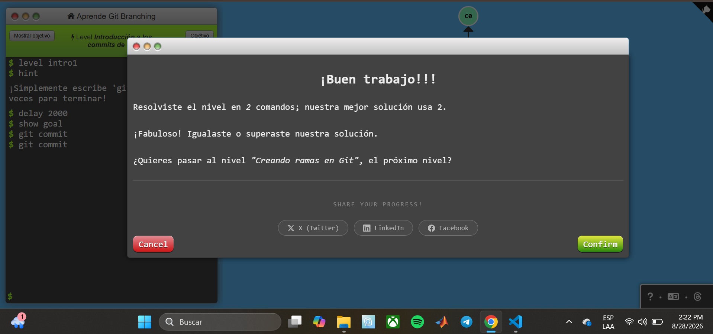

**Aprendizaje:**  

Aprendí que un commit representa una instantánea del estado del
proyecto y que los commits forman un historial en el que cada commit
puede tener como padre al commit anterior.

### M1.2 - Branching in Git

**Objetivo:**  

Comprender cómo funcionan las ramas en Git, crear una nueva rama y
cambiar el trabajo hacia ella para continuar desarrollando de forma
independiente.

**Estado inicial:**  

El repositorio tiene una rama principal llamada `main`, que apunta al
commit actual. `HEAD` se encuentra asociado a la rama `main`.

| Paso | Comando | Efecto sobre el repositorio |
|---:|---|---|
| 1 | `git branch bugfix` | Crea una nueva rama llamada `bugfix` que apunta al commit actual. No cambia la posición de `HEAD` ni mueve la rama `main`. |
| 2 | `git checkout bugfix` | Cambia `HEAD` de `main` a la rama `bugfix`, por lo que los siguientes commits se realizarán sobre esta rama. |

**Estado final:**  

Se creó la rama `bugfix` y `HEAD` quedó apuntando a ella. La rama
`main` permanece en su posición original, mientras que `bugfix` puede
avanzar independientemente.

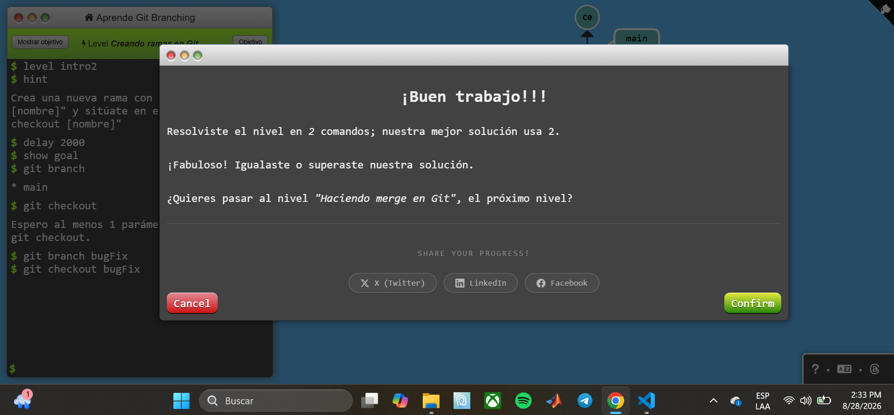

**Aprendizaje:**  

Aprendí que crear una rama no copia el proyecto, sino que crea una
referencia al commit actual. También aprendí que `git checkout` permite
cambiar la rama en la que estamos trabajando.

### M1.3 - Merging in Git

**Objetivo:**  

Aprender a combinar el trabajo de dos ramas mediante `git merge` y
comprender cómo Git crea un commit con dos padres cuando las ramas
contienen trabajo diferente.

**Estado inicial:**  

El repositorio contiene una rama `main`. Se crea la rama `bugFix` para
desarrollar trabajo de forma independiente.

| Paso | Comando | Efecto sobre el repositorio |
|---:|---|---|
| 1 | `git branch bugFix` | Crea la rama `bugFix` apuntando al commit actual. |
| 2 | `git checkout bugFix` | Cambia `HEAD` de `main` a `bugFix`. |
| 3 | `git commit` | Crea un nuevo commit sobre la rama `bugFix`. |
| 4 | `git checkout main` | Cambia `HEAD` nuevamente a la rama `main`. |
| 5 | `git commit` | Crea un nuevo commit sobre `main`, independiente del realizado en `bugFix`. |
| 6 | `git merge bugFix` | Combina el trabajo de `bugFix` con `main` y crea un commit de merge con dos padres. |

**Estado final:**  

La rama `main` contiene tanto el trabajo realizado directamente en
`main` como el trabajo realizado en `bugFix`. El commit generado por
el merge tiene dos padres, por lo que el historial refleja que las dos
líneas de desarrollo fueron unificadas.

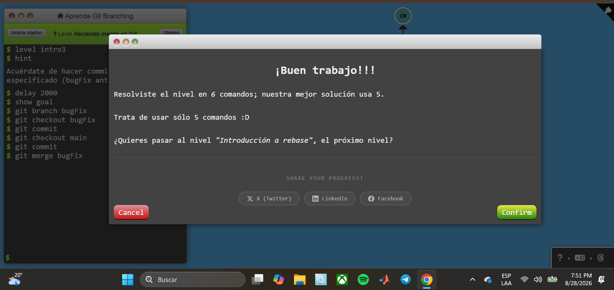

**Aprendizaje:**  

Aprendí que `git merge` permite unir dos líneas de desarrollo. Cuando
ambas ramas tienen commits diferentes, Git puede crear un commit de
merge con dos padres que conserva ambas líneas del historial.

### M1.4 - Rebase Introduction

**Objetivo:**  

Comprender cómo utilizar `git rebase` para colocar los commits de una
rama sobre otra y obtener un historial lineal.

**Estado inicial:**  

El repositorio contiene la rama `main`. Se crea una nueva rama llamada
`bugFix` para realizar trabajo independiente.

| Paso | Comando | Efecto sobre el repositorio |
|---:|---|---|
| 1 | `git checkout -b bugFix` | Crea la rama `bugFix` y cambia `HEAD` hacia ella. |
| 2 | `git commit` | Crea un nuevo commit sobre `bugFix`. |
| 3 | `git checkout main` | Cambia `HEAD` nuevamente hacia la rama `main`. |
| 4 | `git commit` | Crea un nuevo commit sobre `main`. |
| 5 | `git checkout bugFix` | Cambia `HEAD` hacia la rama `bugFix`. |
| 6 | `git rebase main` | Reaplica los commits de `bugFix` sobre la versión más reciente de `main`, produciendo un historial lineal. |

**Estado final:**  

La rama `bugFix` queda ubicada después del último commit de `main`.
El commit original de `bugFix` es reemplazado en la nueva línea de
historial por una copia con un nuevo identificador.

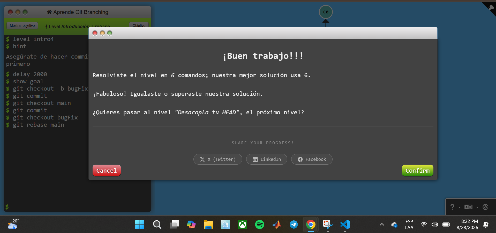

**Aprendizaje:**  

Aprendí que `git rebase` permite reorganizar el historial colocando
los commits de una rama encima de otra. A diferencia de `git merge`,
el rebase puede producir una historia lineal sin crear un commit de
merge.

### M2.1 - Detach yo' HEAD

**Objetivo:**  

Comprender el funcionamiento de `HEAD` y aprender a desacoplarlo de
una rama para apuntarlo directamente a un commit específico.

**Estado inicial:**  

`HEAD` se encuentra asociado a la rama `bugFix`, la cual apunta al
commit objetivo del ejercicio.

| Paso | Comando | Efecto sobre el repositorio |
|---:|---|---|
| 1 | `git checkout <hash>` | Desacopla `HEAD` de la rama `bugFix` y lo coloca directamente sobre el commit indicado mediante su hash. |

**Estado final:**  

`HEAD` queda en estado *detached*, apuntando directamente al commit
seleccionado en lugar de seguir a la rama `bugFix`. La rama `bugFix`
permanece apuntando al mismo commit.

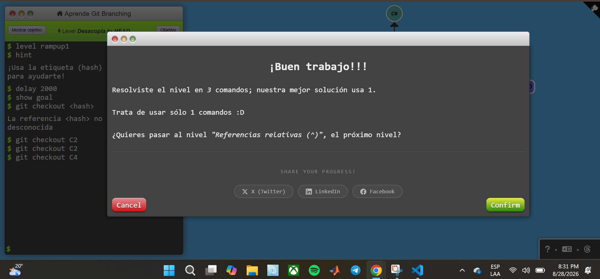

**Aprendizaje:**  

Aprendí que `HEAD` normalmente sigue a una rama, pero también puede
apuntar directamente a un commit. Esta situación se conoce como
*detached HEAD*.

### M2.2 - Relative Refs (^)

**Objetivo:**  

Aprender a utilizar referencias relativas para desplazarse por el
historial de commits sin necesidad de utilizar el hash completo.

**Estado inicial:**  

La rama `bugFix` apunta al commit actual y `HEAD` se encuentra asociado
a dicha rama.

| Paso | Comando | Efecto sobre el repositorio |
|---:|---|---|
| 1 | `git checkout bugFix^` | Mueve `HEAD` al commit padre del commit al que apunta `bugFix`. Como `HEAD` apunta directamente a un commit, queda en estado *detached*. |

**Estado final:**  

`HEAD` queda ubicado en el commit padre de `bugFix`, mientras que la
rama `bugFix` permanece apuntando a su commit original.

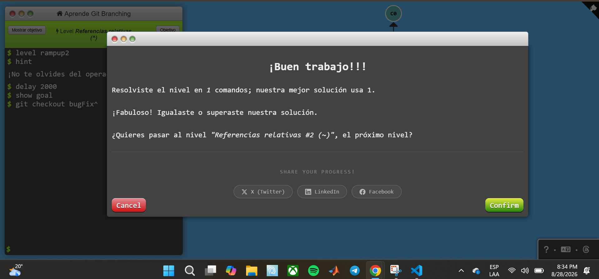

**Aprendizaje:**  

Aprendí que el operador `^` permite acceder al commit padre de una
referencia. Por ejemplo, `bugFix^` representa el padre del commit al
que apunta `bugFix`.

### M2.3 - Relative Refs (~)

**Objetivo:**  

Aprender a utilizar referencias relativas y el parámetro `-f` para
mover ramas directamente hacia commits específicos.

**Estado inicial:**  

El repositorio contiene las ramas `main` y `bugFix`, además de
`HEAD`, ubicadas en diferentes commits del historial. El objetivo es
reubicar las referencias en las posiciones indicadas por el ejercicio.

| Paso | Comando | Efecto sobre el repositorio |
|---:|---|---|
| 1 | `git branch -f bugFix C0` | Mueve forzosamente la rama `bugFix` para que apunte al commit `C0`. |
| 2 | `git branch -f main C6` | Mueve forzosamente la rama `main` para que apunte al commit `C6`. |

**Estado final:**  

La rama `bugFix` apunta a `C0` y la rama `main` apunta a `C6`. `HEAD`
queda ubicado en `C1`, cumpliendo las posiciones requeridas por el
ejercicio.

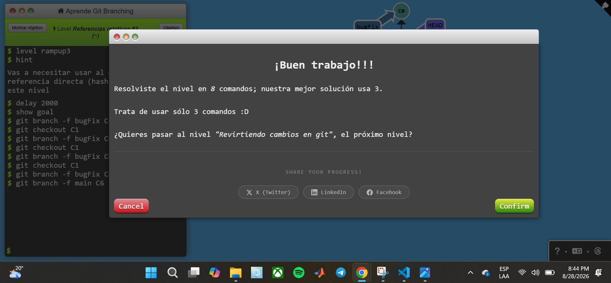

**Aprendizaje:**  

Aprendí que `git branch -f` permite mover una rama directamente a un
commit determinado. También aprendí que las referencias relativas,
como `HEAD~3`, permiten especificar posiciones en el historial sin
tener que escribir hashes completos.

### M2.4 - Revirtiendo cambios en Git

**Objetivo:**  

Aprender a utilizar `git reset` y `git revert` para deshacer cambios,
diferenciando entre ramas locales y ramas remotas.

**Estado inicial:**  

El repositorio contiene las ramas `local` y `pushed`, ambas apuntando
al commit más reciente. El objetivo es revertir dicho commit utilizando
el método adecuado para cada tipo de rama.

| Paso | Comando | Efecto sobre el repositorio |
|---:|---|---|
| 1 | `git reset local^` | Mueve la rama local `local` un commit hacia atrás, eliminando el commit más reciente de su historial. |
| 2 | `git checkout pushed` | Cambia `HEAD` a la rama `pushed` para trabajar sobre ella. |
| 3 | `git revert pushed` | Crea un nuevo commit que revierte los cambios introducidos por el commit más reciente de `pushed`, sin reescribir su historial. |

**Estado final:**  

La rama `local` queda ubicada en el commit anterior mediante `git reset`,
mientras que la rama `pushed` conserva su historial y contiene un nuevo
commit que revierte los cambios del commit anterior mediante `git revert`.

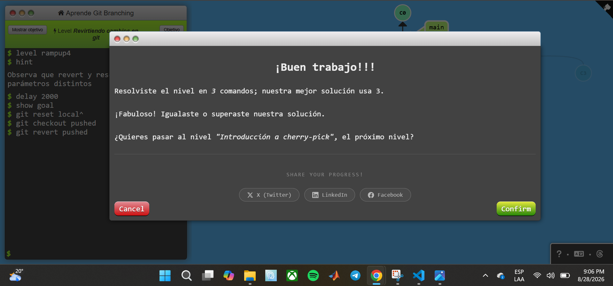

**Aprendizaje:**  

Aprendí que `git reset` permite mover una rama hacia atrás y reescribir
el historial, por lo que es adecuado para ramas locales. En cambio,
`git revert` crea un nuevo commit que deshace los cambios anteriores
sin modificar el historial existente, por lo que es más apropiado para
ramas remotas o compartidas.

### M3.1 - Moviendo el trabajo por ahí (Git Cherry-pick)

**Objetivo:**  

Aprender a utilizar `git cherry-pick` para copiar commits específicos
desde otras ramas y aplicarlos sobre la rama `main`.

**Estado inicial:**  

El repositorio contiene varias ramas con diferentes commits. El objetivo
es copiar los commits `C3`, `C4` y `C7` hacia la rama `main`.

| Paso | Comando | Efecto sobre el repositorio |
|---:|---|---|
| 1 | `git checkout main` | Cambia `HEAD` a la rama `main`, donde se aplicarán los commits. |
| 2 | `git cherry-pick C3 C4 C7` | Copia los commits `C3`, `C4` y `C7` y los aplica sobre la rama `main` en ese orden. |

**Estado final:**  

La rama `main` contiene los cambios de los commits `C3`, `C4` y `C7`
como nuevos commits sobre su historial.

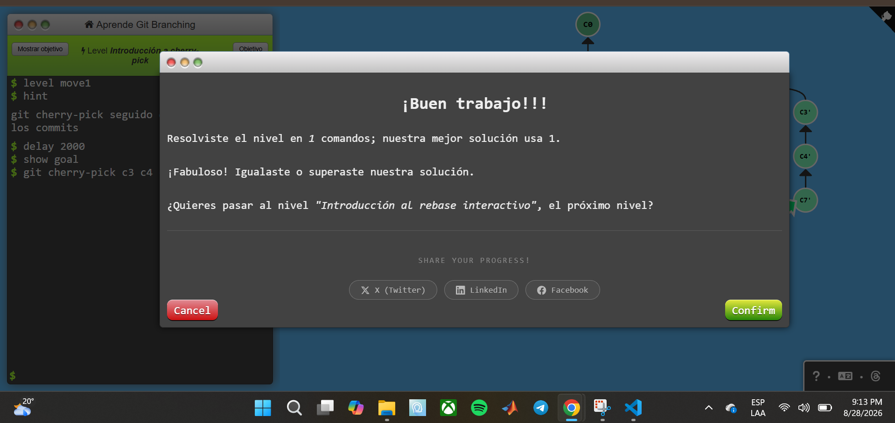

**Aprendizaje:**  

Aprendí que `git cherry-pick` permite copiar uno o varios commits
específicos de otras ramas y aplicarlos directamente sobre la rama
actual, sin necesidad de fusionar toda la rama.

### M3.2 - Git Rebase Interactivo

**Objetivo:**  

Aprender a utilizar `git rebase -i` para revisar, reordenar o ignorar
commits antes de aplicarlos sobre la rama actual.

**Estado inicial:**  

El repositorio contiene varios commits en la rama actual. El objetivo
es realizar un rebase interactivo sobre los últimos cuatro commits y
modificar su orden según la visualización objetivo del ejercicio.

| Paso | Comando | Efecto sobre el repositorio |
|---:|---|---|
| 1 | `git checkout main` | Cambia `HEAD` a la rama `main`. |
| 2 | `git rebase -i HEAD~4` | Abre el rebase interactivo de los últimos cuatro commits, permitiendo reordenarlos o ignorarlos según el objetivo. |

**Estado final:**  

La rama `main` queda con los últimos cuatro commits reorganizados de
acuerdo con el orden indicado en la visualización objetivo del ejercicio.

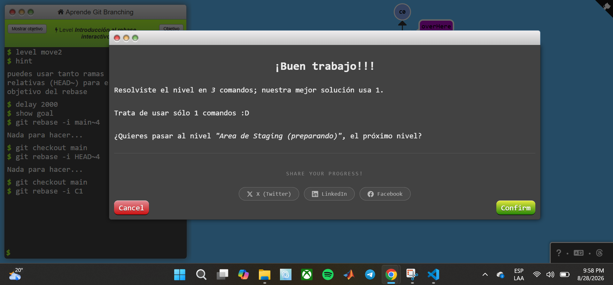

**Aprendizaje:**  

Aprendí que `git rebase -i` permite revisar y modificar el orden de
varios commits antes de aplicarlos. La opción `-i` habilita el modo
interactivo y `HEAD~4` indica que se trabajará con los últimos cuatro
commits.

### M3.3 - The Staging Area

**Objetivo:**  

Aprender a utilizar el área de preparación (*staging area*) para
seleccionar qué cambios se incluirán en cada commit, realizando commits
individuales para cada archivo.

**Estado inicial:**  

El repositorio contiene dos archivos modificados: `app.js` y
`styles.css`. Ninguno de los cambios se encuentra preparado para
realizar un commit. El objetivo es agregar y confirmar cada archivo
por separado.

| Paso | Comando | Efecto sobre el repositorio |
|---:|---|---|
| 1 | `git add app.js` | Agrega los cambios de `app.js` al área de preparación. |
| 2 | `git commit -m "commit app.js"` | Crea un commit que contiene únicamente los cambios de `app.js`. |
| 3 | `git add styles.css` | Agrega los cambios de `styles.css` al área de preparación. |
| 4 | `git commit -m "commit styles.css"` | Crea un commit que contiene únicamente los cambios de `styles.css`. |

**Estado final:**  

Los cambios de `app.js` y `styles.css` quedan registrados en dos
commits independientes, manteniendo cada commit enfocado en un solo
archivo.

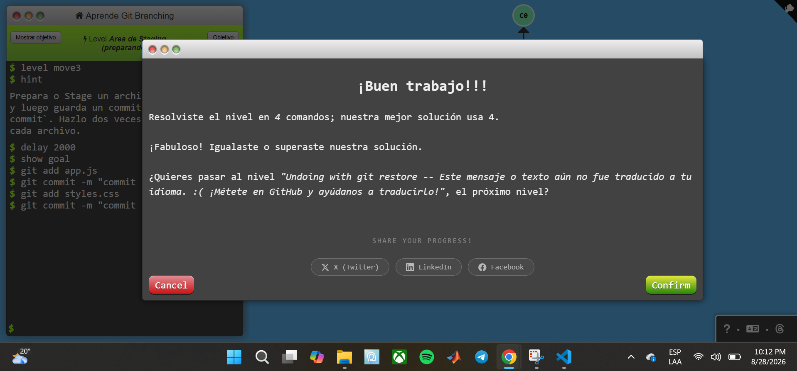

**Aprendizaje:**  

Aprendí que el área de preparación permite seleccionar exactamente qué
cambios serán incluidos en un commit. También aprendí que `git add`
prepara los cambios y `git commit` los guarda en el historial del
repositorio.

### M3.4 - Undoing with `git restore`

**Objetivo:**  

Aprender a utilizar `git restore` para sacar archivos del área de
preparación y descartar cambios no deseados antes de realizar un commit.

**Estado inicial:**  

El repositorio contiene `app.js` y `secret.env` preparados para commit,
mientras que `experiment.js` tiene cambios sin preparar. El objetivo es
conservar los cambios de `app.js`, dejar `secret.env` para un commit
posterior y descartar completamente los cambios de `experiment.js`.

| Paso | Comando | Efecto sobre el repositorio |
|---:|---|---|
| 1 | `git restore --staged secret.env` | Retira `secret.env` del área de preparación, conservando sus cambios para utilizarlos posteriormente. |
| 2 | `git restore experiment.js` | Descarta completamente los cambios realizados en `experiment.js`. |
| 3 | `git commit` | Crea un commit únicamente con los cambios preparados de `app.js`. |

**Estado final:**  

Se crea un commit limpio que contiene únicamente los cambios de
`app.js`. `secret.env` queda fuera del área de preparación para ser
utilizado posteriormente y los cambios de `experiment.js` son
descartados.

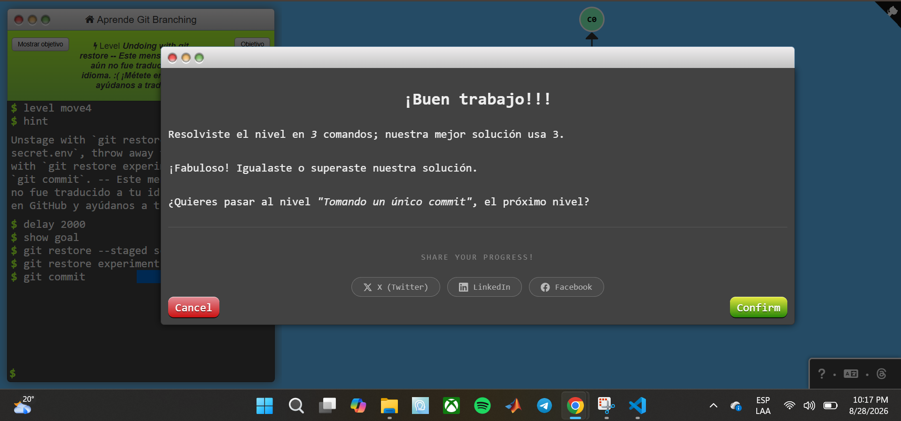

**Aprendizaje:**  

Aprendí que `git restore --staged` permite sacar un archivo del área de
preparación sin perder sus cambios, mientras que `git restore` permite
descartar completamente los cambios de un archivo. También aprendí a
utilizar estos comandos para limpiar el área de trabajo antes de
realizar un commit.

### M4.1 - Grabbing Just 1 Commit

**Objetivo:**  

Aprender a mover únicamente el commit necesario desde una rama de
desarrollo hacia `main`, evitando llevar consigo otros commits que no
son necesarios.

**Estado inicial:**  

El repositorio contiene las ramas `main` y `bugFix`. La rama `bugFix`
contiene varios commits relacionados con la depuración, pero únicamente
el commit al que apunta `bugFix` debe incorporarse a `main`. El objetivo
es evitar que los commits adicionales de debugging lleguen a `main`.

| Paso | Comando | Efecto sobre el repositorio |
|---:|---|---|
| 1 | `git reset --hard C1` | Mueve la rama actual hacia `C1` y descarta los cambios posteriores del directorio de trabajo. |
| 2 | `git cherry-pick bugFix` | Copia el commit al que apunta `bugFix` y lo aplica sobre la posición actual de `main`. |

**Estado final:**  

La rama `main` recibe únicamente el commit referenciado por `bugFix`,
sin incorporar los demás commits de depuración. De esta forma, el
historial de `main` conserva solamente el cambio necesario.

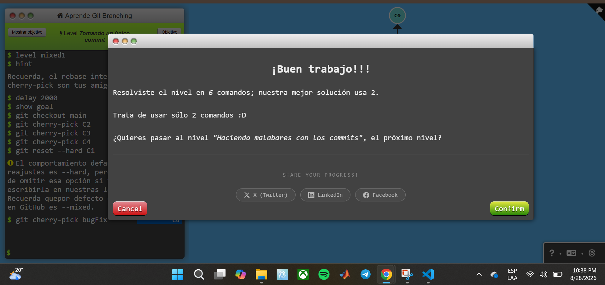

**Aprendizaje:**  

Aprendí que `git cherry-pick` permite seleccionar un commit específico
de otra rama sin incorporar todos sus commits anteriores. También
aprendí que `git reset --hard` permite regresar una rama a un commit
determinado, descartando los cambios posteriores del directorio de
trabajo.

### M4.2 - Juggling Commits

**Objetivo:**  

Aprender a modificar un commit anterior utilizando `git rebase -i` y
`git commit --amend`, reordenando temporalmente los commits y
posteriormente restaurando su orden original.

**Estado inicial:**  

El repositorio contiene dos commits relacionados: `C2` (`newImage`) y
`C3` (`caption`). El objetivo es modificar el commit `C2` sin perder el
commit posterior `C3` y mantener la estructura final del historial.

| Paso | Comando | Efecto sobre el repositorio |
|---:|---|---|
| 1 | `git rebase -i HEAD~2` | Abre el rebase interactivo de los últimos dos commits para reordenarlos. Se coloca `C3` antes de `C2`. |
| 2 | `git commit --amend` | Modifica el commit `C2`, que ahora se encuentra en la cima del historial. |
| 3 | `git rebase -i HEAD~2` | Abre nuevamente el rebase interactivo para regresar los commits a su orden original: `C2''` seguido de `C3'`. |
| 4 | `git branch -f main HEAD` | Mueve la rama `main` a la posición actual, apuntando al historial actualizado. |

**Estado final:**  

La rama `main` queda apuntando al nuevo historial con los commits en su
orden original. El commit modificado posee un apóstrofe adicional debido
al proceso de reordenamiento y modificación.

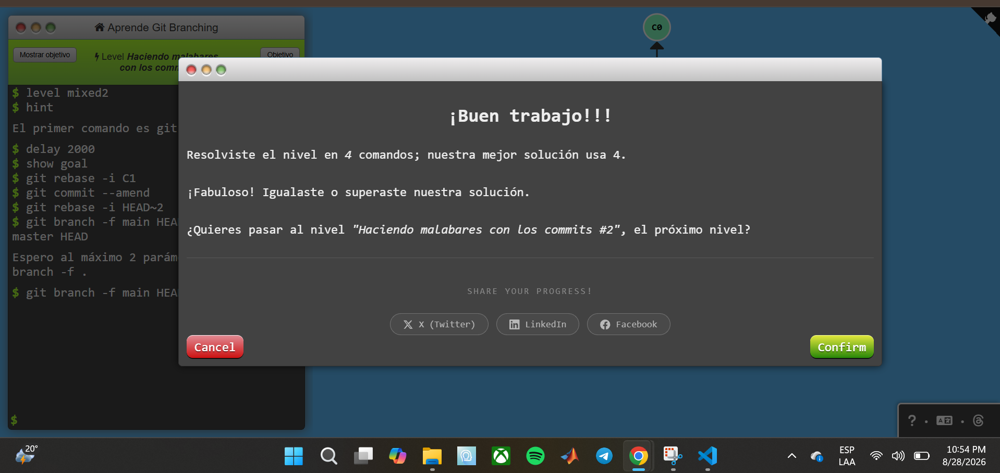

**Aprendizaje:**  

Aprendí que `git rebase -i` permite reordenar commits para modificar uno
que no se encuentra en la cima del historial. También aprendí que
`git commit --amend` permite modificar el commit actual y que
posteriormente se puede utilizar otro rebase interactivo para recuperar
el orden original de los commits.

### M4.3 - Juggling Commits #2

**Objetivo:**  

Aprender a modificar un commit anterior utilizando `git cherry-pick` y
`git commit --amend`, evitando el uso de `git rebase -i` para reorganizar
los commits.

**Estado inicial:**  

El repositorio contiene los commits `C2` y `C3`, donde `C2` necesita ser
modificado. El objetivo es llevar `C2` a la rama `main`, modificarlo y
posteriormente incorporar nuevamente `C3`.

| Paso | Comando | Efecto sobre el repositorio |
|---:|---|---|
| 1 | `git checkout main` | Cambia `HEAD` a la rama `main`. |
| 2 | `git cherry-pick C2` | Copia el commit `C2` y lo aplica sobre la posición actual de `main`. |
| 3 | `git commit --amend` | Modifica el commit `C2` que se encuentra en la cima del historial. |
| 4 | `git cherry-pick C3` | Copia el commit `C3` y lo aplica después del commit modificado. |

**Estado final:**  

La rama `main` contiene el commit `C2` modificado seguido por `C3`.
De esta manera se obtiene el resultado requerido sin utilizar
`git rebase -i`.

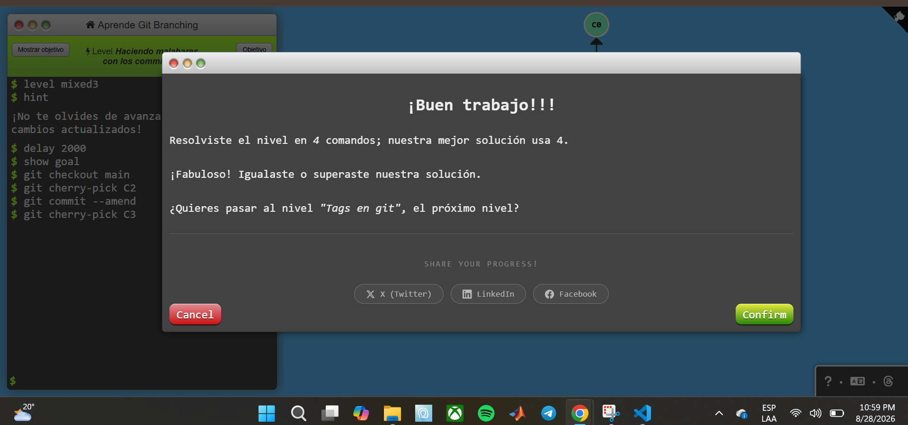

**Aprendizaje:**  

Aprendí que `git cherry-pick` permite traer un commit específico desde
cualquier parte del árbol hasta la posición actual de `HEAD`.
Combinándolo con `git commit --amend`, es posible modificar un commit
anterior sin necesidad de reordenar los commits mediante `git rebase -i`.

### M4.4 - Git Tags

**Objetivo:**  

Aprender a utilizar tags en Git para marcar permanentemente commits
específicos del historial y utilizarlos como referencias para identificar
versiones o hitos importantes del proyecto.

**Estado inicial:**  

El repositorio contiene varios commits. El objetivo es crear los tags
`v0` y `v1` en los commits indicados y posteriormente cambiar `HEAD`
hacia el tag `v1`.

| Paso | Comando | Efecto sobre el repositorio |
|---:|---|---|
| 1 | `git tag v0 C1` | Crea el tag `v0` apuntando permanentemente al commit `C1`. |
| 2 | `git tag v1 C2` | Crea el tag `v1` apuntando permanentemente al commit `C2`. |
| 3 | `git checkout v1` | Mueve `HEAD` al tag `v1`, dejando el repositorio en estado *detached HEAD*. |

**Estado final:**  

Los tags `v0` y `v1` quedan creados en los commits `C1` y `C2`,
respectivamente. `HEAD` queda ubicado sobre el tag `v1` en estado
*detached*, ya que los tags son referencias fijas que no avanzan con
nuevos commits.


**Aprendizaje:**  

Aprendí que los tags permiten marcar commits específicos de forma
permanente, por ejemplo para identificar versiones o hitos importantes.
A diferencia de las ramas, los tags no avanzan cuando se crean nuevos
commits. También aprendí que al hacer `checkout` de un tag, `HEAD` queda
en estado *detached*.

### M4.5 - Git Describe

**Objetivo:**  

Aprender a utilizar `git describe` para identificar la posición de un
commit con respecto al tag más cercano en el historial.

**Estado inicial:**  

El repositorio contiene varios commits y tags que representan diferentes
hitos del proyecto. El objetivo es utilizar referencias para familiarizarse
con `git describe` y posteriormente crear un nuevo commit para completar
el nivel.

| Paso | Comando | Efecto sobre el repositorio |
|---:|---|---|
| 1 | `git commit` | Crea un nuevo commit a partir del estado actual del repositorio y permite completar el nivel. |

**Estado final:**  

Se crea un nuevo commit sobre la posición actual del repositorio,
completando el nivel. Durante el ejercicio se utilizó `git describe`
para comprender cómo Git identifica un commit en relación con el tag
más cercano.


**Aprendizaje:**  

Aprendí que `git describe` permite conocer la posición de un commit
respecto al tag más cercano, indicando el tag, la cantidad de commits
posteriores y el hash del commit. También aprendí que el comando puede
utilizarse con diferentes referencias, como ramas o commits.

### M5.1 - Rebasing over 9000 times

**Objetivo:**  

Aprender a utilizar `git rebase` para reorganizar el trabajo de múltiples
ramas sobre una rama principal, manteniendo todos los commits en un orden
secuencial.

**Estado inicial:**  

El repositorio contiene varias ramas con diferentes commits. El objetivo
es rebasear progresivamente cada rama sobre la anterior hasta conseguir
un historial lineal en `main`, donde los commits queden ordenados
secuencialmente, con `C7` como último commit.

| Paso | Comando | Efecto sobre el repositorio |
|---:|---|---|
| 1 | `git rebase main bugFix` | Rebasea la rama `bugFix` sobre `main`, colocando su trabajo después de los commits de `main`. |
| 2 | `git rebase bugFix side` | Rebasea la rama `side` sobre `bugFix`, colocando sus commits después del trabajo de `bugFix`. |
| 3 | `git rebase side another` | Rebasea la rama `another` sobre `side`, continuando la secuencia de commits. |
| 4 | `git rebase another main` | Rebasea la rama `main` sobre `another`, dejando todo el trabajo organizado en una única secuencia. |

**Estado final:**  

Las diferentes ramas quedan reorganizadas mediante `git rebase` y los
commits se encuentran en un historial lineal y secuencial, con `C7`
ubicado al final, seguido de `C6` y los demás commits en el orden
requerido por el ejercicio.


**Aprendizaje:**  

Aprendí que `git rebase` puede utilizar una rama como segundo argumento
para realizar el checkout y el rebase en un solo comando. Esto permite
reorganizar múltiples ramas de forma más eficiente y construir un
historial lineal con los commits en el orden deseado.

### M5.2 - Multiple Parents

**Objetivo:**  

Aprender a utilizar referencias relativas con `^` y `~` para
desplazarse por diferentes padres de un commit de merge y combinar
ambos modificadores en una sola referencia.

**Estado inicial:**  

El repositorio contiene un commit de merge con múltiples padres. El
objetivo es utilizar referencias relativas para recorrer el historial
siguiendo específicamente el segundo padre del merge y posteriormente
crear la rama `bugWork` en la posición indicada.

| Paso | Comando | Efecto sobre el repositorio |
|---:|---|---|
| 1 | `git branch bugWork HEAD~^2~` | Crea la rama `bugWork` en el commit obtenido al combinar las referencias relativas `~`, `^2` y `~`, siguiendo el segundo padre del commit de merge y desplazándose posteriormente por sus ancestros. |

**Estado final:**  

La rama `bugWork` queda ubicada en el commit indicado por el ejercicio,
siguiendo correctamente el segundo padre del commit de merge y los
ancestros correspondientes mediante las referencias relativas.


**Aprendizaje:**  

Aprendí que `^` permite seleccionar un padre específico de un commit de
merge, mientras que `~` permite avanzar hacia atrás en el historial.
También aprendí que ambos modificadores pueden combinarse y encadenarse
en una misma referencia, como en `HEAD~^2~`.

### M5.3 - Branch Spaghetti

**Objetivo:**  

Aprender a reorganizar y actualizar varias ramas utilizando
`git cherry-pick` y `git branch -f`, aplicando únicamente los commits
necesarios en cada rama.

**Estado inicial:**  

La rama `main` se encuentra varios commits por delante de las ramas
`one`, `two` y `three`. Cada una requiere una modificación diferente
de los últimos commits de `main`: la rama `one` necesita reordenar sus
commits y eliminar `C5`, la rama `two` necesita únicamente reordenarlos
y la rama `three` necesita solamente incorporar un commit.

| Paso | Comando | Efecto sobre el repositorio |
|---:|---|---|
| 1 | `git checkout one` | Cambia `HEAD` a la rama `one`. |
| 2 | `git cherry-pick C4 C3 C2` | Copia los commits `C4`, `C3` y `C2` sobre `one` en ese orden, reorganizando su historial y evitando incorporar `C5`. |
| 3 | `git checkout two` | Cambia `HEAD` a la rama `two`. |
| 4 | `git cherry-pick C5 C4 C3 C2` | Copia los commits `C5`, `C4`, `C3` y `C2` sobre `two` en el orden indicado. |
| 5 | `git branch -f three C2` | Mueve la rama `three` directamente al commit `C2`, incorporando únicamente ese commit en su historial. |

**Estado final:**  

Las ramas `one`, `two` y `three` quedan actualizadas de acuerdo con los
requisitos del ejercicio. `one` contiene los commits reorganizados sin
`C5`, `two` contiene los commits en el orden requerido y `three` queda
ubicada directamente en `C2`.

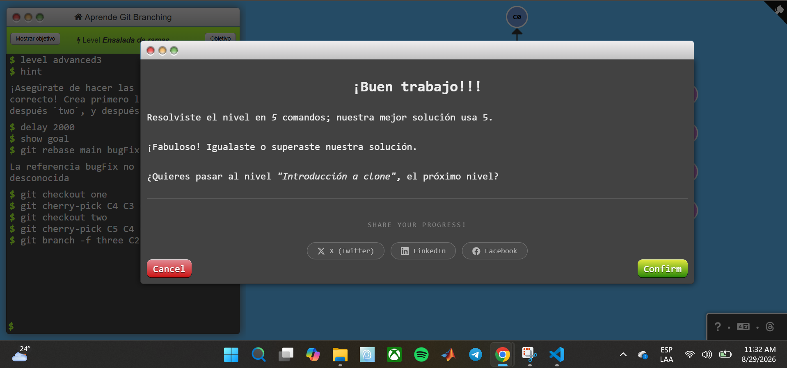

**Aprendizaje:**  

Aprendí que `git cherry-pick` permite seleccionar y reordenar commits
específicos al copiarlos sobre una rama. También aprendí que
`git branch -f` permite mover directamente una referencia de rama hacia
un commit determinado, lo que resulta útil para actualizar ramas de
forma precisa.

### Main completo 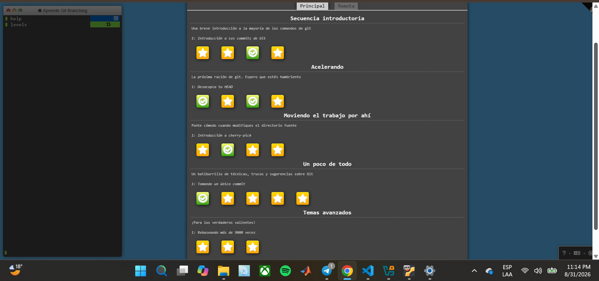

# Remote

### R1.1 - Git Remotes

**Objetivo:**  

Comprender el concepto de repositorios remotos y aprender a utilizar
`git clone` para crear un repositorio remoto a partir del repositorio
actual.

**Estado inicial:**  

El repositorio contiene el proyecto y su historial de commits de forma
local. El objetivo es crear un repositorio remoto asociado al repositorio
existente mediante el comando `git clone`.

| Paso | Comando | Efecto sobre el repositorio |
|---:|---|---|
| 1 | `git clone` | Crea un repositorio remoto a partir del repositorio local existente, permitiendo posteriormente compartir y transferir trabajo entre ambos repositorios. |

**Estado final:**  

Se crea un repositorio remoto asociado al proyecto. El repositorio local
mantiene su historial y queda preparado para comenzar a trabajar con
operaciones de Git remoto en los siguientes niveles.

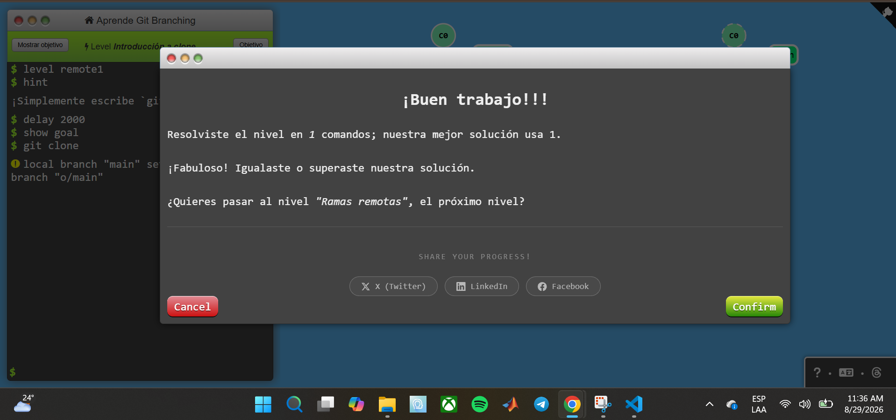

**Aprendizaje:**  

Aprendí que un repositorio remoto es una copia del repositorio que se
encuentra en otra ubicación y permite respaldar y compartir el trabajo.
También aprendí que `git clone` se utiliza normalmente para crear una
copia local de un repositorio remoto y que, en este entorno de
aprendizaje, se utiliza para inicializar el repositorio remoto.

### R1.2 - Ramas remotas de Git

**Objetivo:**  

Comprender el funcionamiento de las ramas remotas y aprender cómo se
comportan al cambiar entre una rama local y una rama remota.

**Estado inicial:**  

El repositorio contiene una rama local `main` y una rama remota
`o/main`, que representa el estado de la rama `main` en el repositorio
remoto. El objetivo es realizar un commit sobre `main` y posteriormente
hacer checkout de `o/main` para observar el comportamiento de una rama
remota.

| Paso | Comando | Efecto sobre el repositorio |
|---:|---|---|
| 1 | `git commit` | Crea un nuevo commit sobre la rama local `main`, avanzando su referencia sin modificar `o/main`. |
| 2 | `git checkout o/main` | Cambia `HEAD` a la rama remota `o/main`, dejándolo en estado *detached HEAD*. |
| 3 | `git commit` | Crea un nuevo commit desde la posición actual de `HEAD`, sin mover la referencia `o/main`, ya que las ramas remotas representan el estado conocido del repositorio remoto. |

**Estado final:**  

La rama local `main` contiene el primer commit realizado, mientras que
`o/main` conserva la posición que tenía antes. Después de hacer
checkout de `o/main`, `HEAD` queda en estado *detached* y el segundo
commit no mueve la referencia de la rama remota.

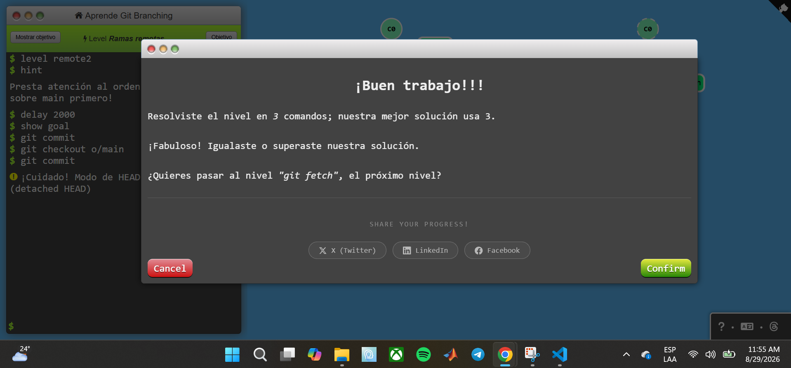

**Aprendizaje:**  

Aprendí que las ramas remotas, como `o/main`, sirven para representar
el estado conocido de una rama en el repositorio remoto. También aprendí
que no se trabaja directamente sobre ellas: al hacer `checkout` de una
rama remota, `HEAD` queda en estado *detached*. Las ramas remotas se
actualizan cuando se sincroniza el estado con el repositorio remoto.

### R1.3 - Git Fetch

**Objetivo:**  

Aprender a utilizar `git fetch` para descargar los commits que existen
en el repositorio remoto y actualizar las referencias de las ramas
remotas sin modificar el estado de trabajo local.

**Estado inicial:**  

El repositorio remoto contiene commits que todavía no están presentes
en el repositorio local. La rama remota `o/main` no refleja todavía
estos nuevos commits. El objetivo es sincronizar la información del
repositorio remoto mediante `git fetch`.

| Paso | Comando | Efecto sobre el repositorio |
|---:|---|---|
| 1 | `git fetch` | Descarga los commits que existen en el repositorio remoto pero que aún no están en el repositorio local y actualiza la referencia `o/main`. |

**Estado final:**  

Los nuevos commits del repositorio remoto quedan disponibles en el
repositorio local y la rama remota `o/main` se actualiza para reflejar
el estado actual del repositorio remoto. La rama local `main` y los
archivos del directorio de trabajo no se modifican.


**Aprendizaje:**  

Aprendí que `git fetch` permite sincronizar el repositorio local con la
información disponible en el repositorio remoto. También aprendí que
`fetch` descarga commits y actualiza las ramas remotas, pero no modifica
la rama local `main` ni los archivos del directorio de trabajo.

### R1.4 - Git Pull

**Objetivo:**  

Aprender a utilizar `git pull` para descargar los cambios de un
repositorio remoto e integrarlos directamente en la rama local.

**Estado inicial:**  

El repositorio remoto contiene nuevos commits que todavía no están
integrados en la rama local `main`. El objetivo es actualizar el trabajo
local utilizando `git pull`.

| Paso | Comando | Efecto sobre el repositorio |
|---:|---|---|
| 1 | `git pull` | Descarga los nuevos commits del repositorio remoto y los integra con la rama local mediante un merge. |

**Estado final:**  

La rama local `main` queda actualizada con los cambios provenientes del
repositorio remoto. `git pull` realiza de forma conjunta las operaciones
de `git fetch` y `git merge`, evitando tener que ejecutar ambos comandos
por separado.

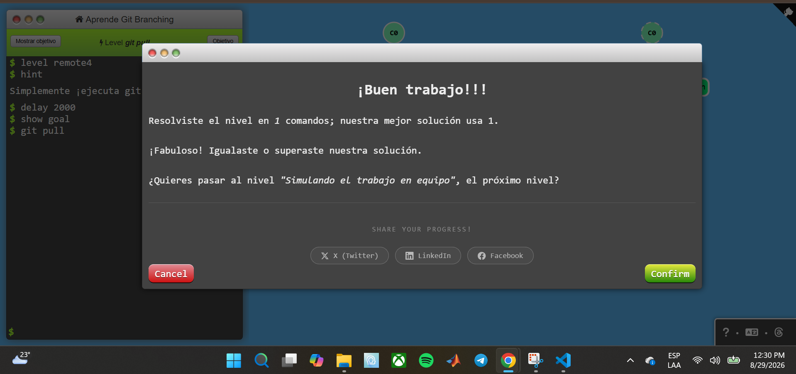

**Aprendizaje:**  

Aprendí que `git pull` es una forma abreviada de realizar un `git fetch`
seguido de un `git merge`. Esto permite descargar los cambios del
repositorio remoto e integrarlos en la rama local en una sola operación. 

### R1.5 - Simulando la colaboración

**Objetivo:**  

Aprender a simular el trabajo de otros colaboradores en un repositorio
remoto y practicar un flujo completo de colaboración utilizando
`git clone`, `git fakeTeamwork`, `git commit` y `git pull`.

**Estado inicial:**  

El repositorio contiene el proyecto local y no se ha creado todavía el
repositorio remoto. El objetivo es crear el remoto, simular un cambio
realizado por un colaborador, realizar un cambio local y finalmente
integrar ambos trabajos.

| Paso | Comando | Efecto sobre el repositorio |
|---:|---|---|
| 1 | `git clone` | Crea un repositorio remoto a partir del repositorio local existente. |
| 2 | `git fakeTeamwork origin 1` | Simula que un colaborador realizó y publicó un commit en la rama `main` del repositorio remoto `origin`. |
| 3 | `git commit` | Crea un nuevo commit en el repositorio local, representando trabajo realizado localmente. |
| 4 | `git pull` | Descarga el commit realizado por el colaborador y lo integra con el trabajo local mediante un pull. |

**Estado final:**  

El repositorio local contiene tanto el trabajo realizado localmente como
el cambio simulado del colaborador. Los cambios del repositorio remoto
fueron descargados e integrados mediante `git pull`.

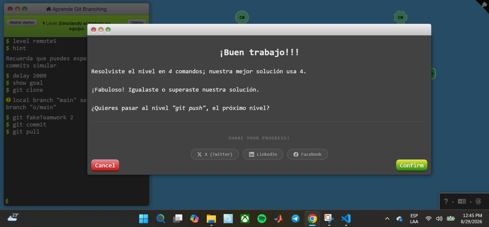

**Aprendizaje:**  

Aprendí a simular un escenario de colaboración utilizando
`git fakeTeamwork`. También aprendí a combinar cambios locales y remotos
mediante `git pull`, integrando el trabajo realizado por otros
colaboradores con el trabajo local.

### R1.6 - Git Push

**Objetivo:**  

Aprender a utilizar `git push` para compartir los commits realizados
localmente con un repositorio remoto y actualizar su estado.

**Estado inicial:**  

El repositorio local contiene cambios que todavía no han sido enviados
al repositorio remoto. El objetivo es crear dos nuevos commits y
posteriormente publicarlos en el repositorio remoto mediante
`git push`.

| Paso | Comando | Efecto sobre el repositorio |
|---:|---|---|
| 1 | `git commit` | Crea un nuevo commit con los cambios realizados en el repositorio local. |
| 2 | `git commit` | Crea un segundo commit sobre el anterior, avanzando la rama local. |
| 3 | `git push` | Envía los nuevos commits al repositorio remoto y actualiza la rama remota para reflejar los cambios publicados. |

**Estado final:**  

Los dos nuevos commits realizados localmente son enviados al repositorio
remoto. La rama local y la rama remota quedan sincronizadas en el último
commit publicado.


**Aprendizaje:**  

Aprendí que `git push` permite publicar los commits locales en un
repositorio remoto para compartirlos con otros colaboradores. También
aprendí que los commits deben existir primero en el repositorio local
antes de poder enviarlos mediante `git push`.

### R1.7 - Trabajo divergente

**Objetivo:**  

Aprender a resolver una divergencia entre el repositorio local y el
repositorio remoto mediante `git fetch`, `git merge` y `git push`.

**Estado inicial:**  

El repositorio local y el remoto parten de un estado común. El objetivo
es simular el trabajo realizado por un colega en el repositorio remoto,
realizar un cambio local y posteriormente integrar ambos trabajos antes
de publicar los cambios.

| Paso | Comando | Efecto sobre el repositorio |
|---:|---|---|
| 1 | `git clone` | Crea el repositorio remoto a partir del repositorio local existente. |
| 2 | `git fakeTeamwork origin 1` | Simula que un colega realizó y publicó un commit en el repositorio remoto `origin`. |
| 3 | `git commit` | Crea un nuevo commit local basado en el estado anterior al cambio realizado por el colega. |
| 4 | `git fetch` | Descarga el nuevo commit del repositorio remoto y actualiza la referencia `o/main`, sin modificar la rama local `main`. |
| 5 | `git merge o/main` | Integra los cambios de la rama remota `o/main` con el trabajo local, creando un commit de merge. |
| 6 | `git push` | Publica los cambios integrados en el repositorio remoto. |

**Estado final:**  

El trabajo realizado por el colega queda integrado con el trabajo local
mediante un commit de merge. Posteriormente, `git push` publica el
historial actualizado en el repositorio remoto, dejando ambas versiones
sincronizadas.

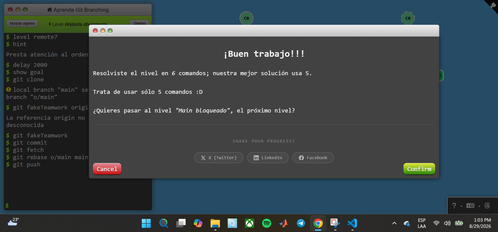

**Aprendizaje:**  

Aprendí que cuando el historial local y el remoto han divergido, es
necesario integrar primero los cambios del repositorio remoto antes de
realizar un `push`. También aprendí que `git fetch` permite actualizar
la información del remoto, `git merge o/main` integra esos cambios con
el trabajo local y `git push` publica finalmente el resultado.

### R1.8 - Remote Rejected!

**Objetivo:**  

Aprender a resolver un rechazo de `git push` causado por una política
que impide realizar cambios directamente sobre la rama `main` y
requiere utilizar una rama independiente para posteriormente crear un
Pull Request.

**Estado inicial:**  

El repositorio contiene cambios realizados directamente sobre la rama
`main`, pero el repositorio remoto tiene protegida dicha rama y no
permite recibir estos cambios mediante `push`. El objetivo es regresar
`main` al estado del repositorio remoto y mover el trabajo realizado a
una nueva rama llamada `feature`.

| Paso | Comando | Efecto sobre el repositorio |
|---:|---|---|
| 1 | `git reset --hard o/main` | Restablece la rama local `main` al mismo commit al que apunta la rama remota `o/main`, descartando el commit realizado directamente sobre `main`. |
| 2 | `git checkout -b feature C2` | Crea la rama `feature` a partir del commit `C2` y cambia `HEAD` hacia ella. |
| 3 | `git push origin feature` | Publica la rama `feature` y sus cambios en el repositorio remoto `origin`. |

**Estado final:**  

La rama local `main` vuelve a estar sincronizada con `o/main`, mientras
que el trabajo que se había realizado sobre `main` queda conservado en
la nueva rama `feature`. Esta rama es publicada en el repositorio remoto
y puede utilizarse posteriormente para crear un Pull Request.

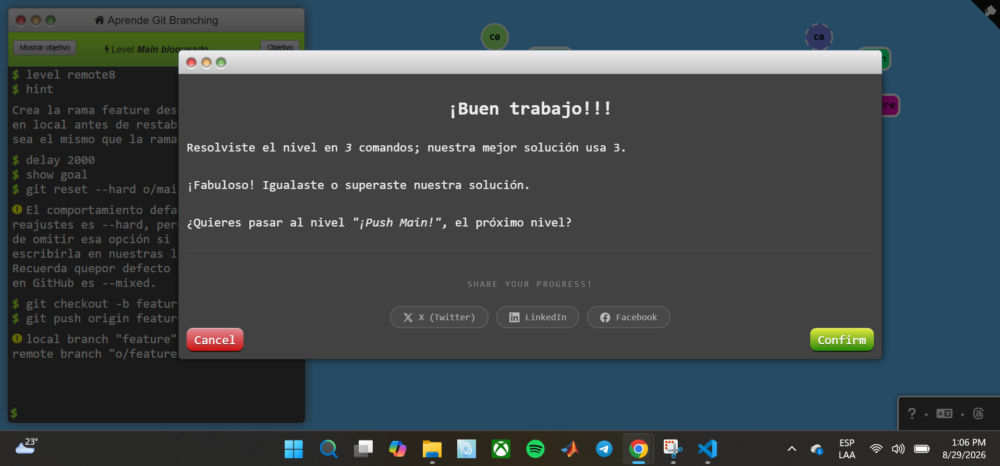

**Aprendizaje:**  

Aprendí que una rama protegida puede rechazar cambios realizados
directamente mediante `push`. También aprendí que, en estos casos, es
posible conservar el trabajo creando una rama independiente, publicar
esa rama en el remoto y utilizarla para realizar posteriormente un Pull
Request. Además, `git reset --hard o/main` permite volver a sincronizar
la rama local `main` con su referencia remota.

### R2.1 - Haciendo merge con ramas de trabajo**

****Objetivo:****

Aprender a integrar el trabajo de varias ramas de trabajo con la rama `main`, manteniendo el repositorio local actualizado con el remoto y publicando finalmente los cambios mediante `git push`.

****Estado inicial:****

El repositorio contiene tres ramas de trabajo: `side1`, `side2` y `side3`. Además, el repositorio remoto contiene cambios que todavía no se encuentran integrados en el repositorio local. El objetivo es integrar las tres ramas en `main` en el orden indicado y posteriormente publicar el resultado en el remoto.

| Paso | Comando                   | Efecto sobre el repositorio                                                                                                                   |
| ---: | ------------------------- | --------------------------------------------------------------------------------------------------------------------------------------------- |
|    1 | `git fetch`               | Descarga los cambios del repositorio remoto y actualiza las referencias remotas, como `o/main`, sin modificar directamente las ramas locales. |
|    2 | `git rebase o/main side1` | Reubica la rama `side1` sobre la versión más reciente de `o/main`, incorporando primero los cambios del remoto.                               |
|    3 | `git rebase side1 side2`  | Reubica la rama `side2` sobre `side1`, colocando su trabajo después de los commits de `side1`.                                                |
|    4 | `git rebase side2 side3`  | Reubica la rama `side3` sobre `side2`, manteniendo el orden secuencial de las ramas de trabajo.                                               |
|    5 | `git rebase side3 main`   | Reubica la rama `main` sobre `side3`, integrando el trabajo de las tres ramas en `main`.                                                      |
|    6 | `git push`                | Publica en el repositorio remoto los cambios integrados en `main`.                                                                            |

****Estado final:****

La rama `main` contiene los cambios provenientes de `side1`, `side2` y `side3`, además de los cambios que estaban previamente en el repositorio remoto. El historial queda organizado de forma lineal y los cambios son publicados mediante `git push`.


****Aprendizaje:****

Aprendí a combinar `git fetch`, `git rebase` y `git push` para integrar varias ramas de trabajo manteniendo `main` actualizado con el repositorio remoto. También aprendí que las ramas pueden rebasarse de forma secuencial para conservar un historial lineal y ordenado.

### R2.2 - ¿Por qué no hacer merge?

****Objetivo:****

Aprender a integrar los cambios del repositorio remoto y de varias ramas de trabajo utilizando `git merge` en lugar de `git rebase`, manteniendo la historia de los commits sin reescribirla.

****Estado inicial:****

El repositorio contiene tres ramas de trabajo: `side1`, `side2` y `side3`. Además, el repositorio remoto contiene cambios que todavía no se encuentran integrados en el repositorio local. El objetivo es integrar los cambios del remoto y posteriormente combinar las tres ramas de trabajo con `main` utilizando `git merge`.

| Paso | Comando             | Efecto sobre el repositorio                                                                                                                   |
| ---: | ------------------- | --------------------------------------------------------------------------------------------------------------------------------------------- |
|    1 | `git checkout main` | Cambia `HEAD` a la rama `main`, donde se integrarán los diferentes cambios.                                                                   |
|    2 | `git fetch`         | Descarga los cambios del repositorio remoto y actualiza las referencias remotas, como `o/main`, sin modificar directamente las ramas locales. |
|    3 | `git merge o/main`  | Integra en `main` los cambios obtenidos del repositorio remoto.                                                                               |
|    4 | `git merge side1`   | Integra el trabajo realizado en la rama `side1` dentro de `main`.                                                                             |
|    5 | `git merge side2`   | Integra el trabajo realizado en la rama `side2` dentro de `main`.                                                                             |
|    6 | `git merge side3`   | Integra el trabajo realizado en la rama `side3` dentro de `main`.                                                                             |
|    7 | `git push`          | Publica en el repositorio remoto los cambios integrados en `main`.                                                                            |

****Estado final:****

La rama `main` contiene los cambios del repositorio remoto y el trabajo realizado en `side1`, `side2` y `side3`. A diferencia del nivel anterior, los cambios se integran mediante `merge`, conservando la historia de las diferentes ramas y evitando reescribir los commits existentes.


****Aprendizaje:****

Aprendí que `git merge` permite integrar cambios de diferentes ramas sin reescribir la historia existente. También comprendí que, al trabajar con repositorios remotos, es posible utilizar `merge` para incorporar los cambios remotos y posteriormente integrar las ramas de trabajo antes de realizar un `push`.

### R2.3 - Ramas que trackean remotos

****Objetivo:****

Aprender cómo funcionan las ramas locales que trackean ramas remotas y utilizar esta relación para realizar operaciones de sincronización y publicación sin trabajar directamente sobre la rama local `main`.

****Estado inicial:****

El repositorio contiene una rama remota `o/main` y una rama local `main`. El objetivo es crear una nueva rama local llamada `side` que trackee `o/main`, realizar un commit sobre ella, actualizarla mediante un `pull --rebase` y finalmente publicar los cambios en el repositorio remoto.

| Paso | Comando                       | Efecto sobre el repositorio                                                                                            |
| ---: | ----------------------------- | ---------------------------------------------------------------------------------------------------------------------- |
|    1 | `git checkout -b side o/main` | Crea la rama local `side` a partir de `o/main` y establece automáticamente que `side` trackee la rama remota `o/main`. |
|    2 | `git commit`                  | Crea un nuevo commit sobre la rama local `side`.                                                                       |
|    3 | `git pull --rebase`           | Descarga los cambios del remoto e integra los cambios de `o/main` mediante un rebase, manteniendo un historial lineal. |
|    4 | `git push`                    | Publica los cambios de la rama `side` en la rama remota que esta trackea.                                              |

****Estado final:****

La rama local `side` queda configurada para trackear `o/main`. Después de realizar el commit y sincronizar los cambios mediante `git pull --rebase`, el trabajo se publica en el repositorio remoto utilizando `git push`, sin necesidad de cambiar a la rama local `main`.

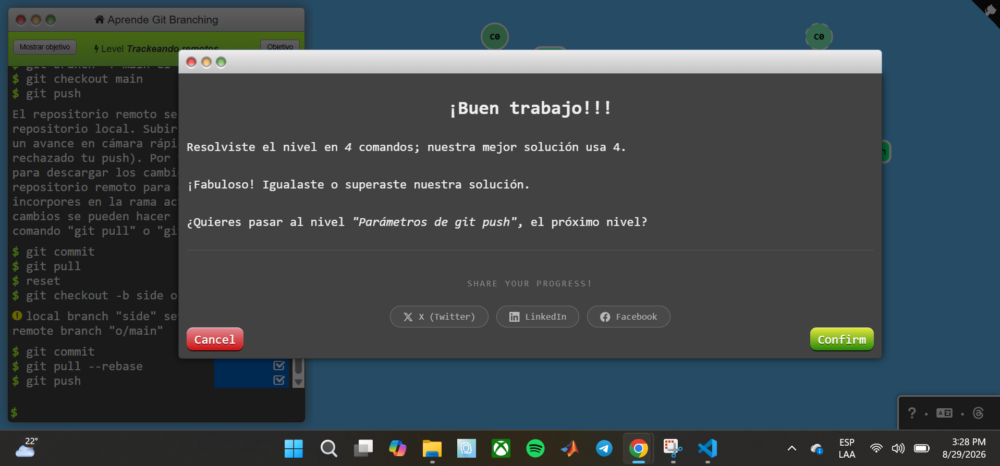

****Aprendizaje:****

Aprendí que al crear una rama local a partir de una rama remota con `git checkout -b`, Git puede establecer automáticamente una relación de tracking. Esta relación permite utilizar comandos como `git pull` y `git push` sin tener que especificar cada vez la rama remota. También aprendí a utilizar `git pull --rebase` para actualizar el trabajo manteniendo un historial lineal.

### R2.4 - Parámetros de push

****Objetivo:****

Aprender a utilizar los parámetros de `git push` para especificar explícitamente el repositorio remoto y la rama que se desea actualizar.

****Estado inicial:****

El repositorio contiene las ramas locales `main` y `foo`, además de un repositorio remoto llamado `origin`. En este nivel `git checkout` está deshabilitado, por lo que es necesario indicar directamente mediante los parámetros de `git push` qué ramas se desean actualizar en el remoto.

| Paso | Comando                | Efecto sobre el repositorio                                                                    |
| ---: | ---------------------- | ---------------------------------------------------------------------------------------------- |
|    1 | `git push origin main` | Publica los commits de la rama local `main` en la rama `main` del repositorio remoto `origin`. |
|    2 | `git push origin foo`  | Publica los commits de la rama local `foo` en la rama `foo` del repositorio remoto `origin`.   |

****Estado final:****

Las ramas `main` y `foo` del repositorio remoto `origin` quedan actualizadas con los commits correspondientes de las ramas locales.

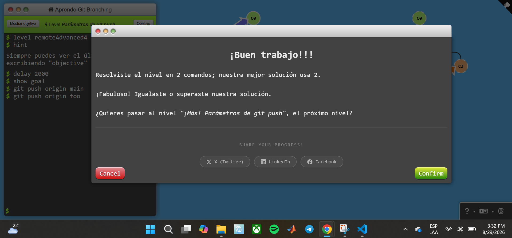

****Aprendizaje:****

Aprendí que `git push` puede recibir un repositorio remoto y una rama como parámetros. La estructura `git push <remoto> <lugar>` permite especificar explícitamente de dónde tomar los commits y hacia qué rama del repositorio remoto enviarlos, sin depender de la rama en la que se encuentre `HEAD`.

### R2.5 - Refspec con dos puntos

****Objetivo:****

Aprender a utilizar la sintaxis `<origen>:<destino>` en `git push` para especificar de manera independiente la rama o referencia local de la cual se tomarán los commits y la rama remota a la cual serán enviados.

****Estado inicial:****

El repositorio contiene las ramas locales `main` y `foo`, además de un repositorio remoto llamado `origin`. En este nivel se debe utilizar la sintaxis de refspec con dos puntos para enviar commits desde una rama o referencia local hacia una rama específica del repositorio remoto.

| Paso | Comando                     | Efecto sobre el repositorio                                                                                                              |
| ---: | --------------------------- | ---------------------------------------------------------------------------------------------------------------------------------------- |
|    1 | `git push origin main^:foo` | Toma la referencia `main^`, que corresponde al commit anterior de `main`, y la publica en la rama `foo` del repositorio remoto `origin`. |
|    2 | `git push origin foo:main`  | Toma los commits de la rama local `foo` y los publica en la rama `main` del repositorio remoto `origin`.                                 |

****Estado final:****

La rama `foo` del repositorio remoto queda actualizada con la referencia indicada desde `main`, y posteriormente la rama `main` del repositorio remoto queda actualizada con los commits de la rama local `foo`.

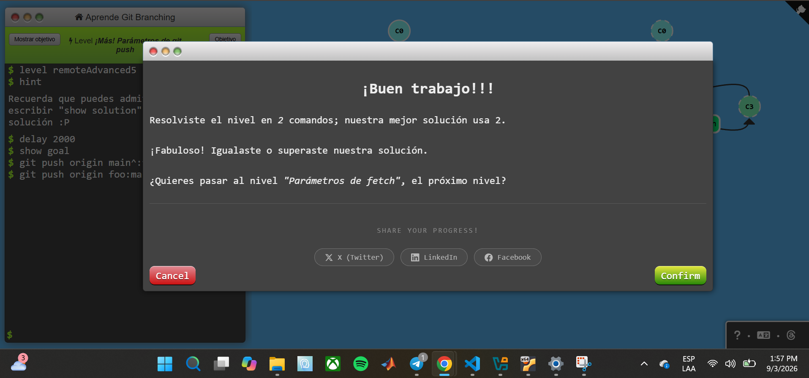

****Aprendizaje:****

Aprendí que `git push` permite especificar de forma independiente el origen y el destino mediante la sintaxis `<origen>:<destino>`. Esto permite enviar los commits de una rama o referencia local hacia una rama diferente en el repositorio remoto. También aprendí que el origen no tiene que ser necesariamente una rama, ya que Git puede utilizar otras referencias, como `main^`, para seleccionar un commit específico.

### R2.6 - Parámetros de `git fetch`

****Objetivo:****

Aprender a utilizar los parámetros de `git fetch` para especificar explícitamente qué commits del repositorio remoto se desean descargar y hacia qué rama o referencia local deben dirigirse. También comprender la diferencia en la sintaxis `<origen>:<destino>` con respecto a `git push`.

****Estado inicial:****

El repositorio contiene ramas locales y ramas remotas asociadas al repositorio `origin`. En este nivel se debe utilizar una refspec con dos puntos para indicar tanto el origen remoto de los commits como el destino local donde serán almacenados.

| Paso | Comando                    | Efecto sobre el repositorio                                                                                        |
| ---: | -------------------------- | ------------------------------------------------------------------------------------------------------------------ |
|    1 | `git fetch origin c3:foo`  | Descarga desde `origin` los commits correspondientes a la referencia `c3` y los incorpora en la rama local `foo`.  |
|    2 | `git fetch origin c6:main` | Descarga desde `origin` los commits correspondientes a la referencia `c6` y los incorpora en la rama local `main`. |

****Estado final:****

Los commits especificados desde el repositorio remoto `origin` quedan descargados en las ramas locales correspondientes: `c3` se lleva a `foo` y `c6` se lleva a `main`.

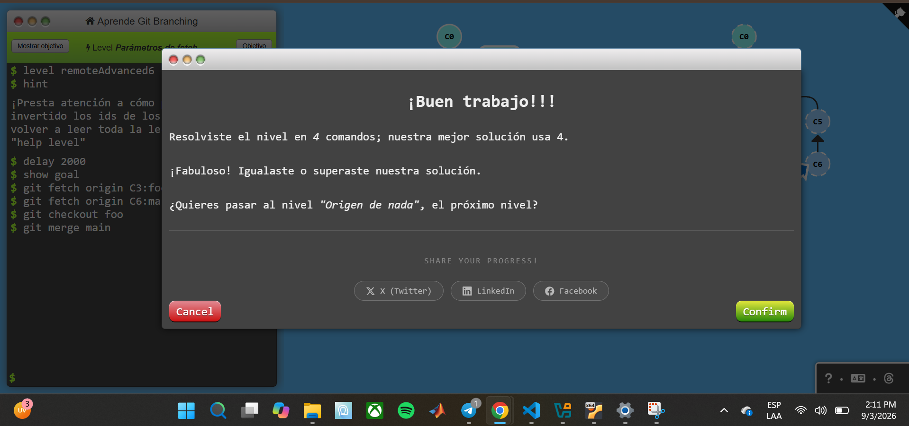

****Aprendizaje:****

Aprendí que `git fetch` también permite utilizar una refspec con la estructura `<origen>:<destino>`, pero en dirección opuesta a `git push`. En este caso, el origen corresponde a una referencia del repositorio remoto y el destino corresponde a una rama o referencia local. Esto permite controlar específicamente qué commits se descargan y dónde se almacenan localmente.

### R2.7 - Rarezas de `<origen>`

****Objetivo:****

Aprender los comportamientos especiales que se producen al utilizar un origen vacío en los comandos `git push` y `git fetch`, y comprender cómo Git utiliza esta sintaxis para eliminar ramas remotas o crear nuevas ramas locales.

****Estado inicial:****

El repositorio contiene ramas locales y remotas que serán modificadas mediante un origen vacío. En este nivel se debe utilizar la sintaxis `:<destino>` para realizar las operaciones solicitadas.

| Paso | Comando                | Efecto sobre el repositorio                                                                                                |
| ---: | ---------------------- | -------------------------------------------------------------------------------------------------------------------------- |
|    1 | `git push origin:foo`  | Realiza un push sin especificar un origen, lo que provoca que la rama remota `foo` sea eliminada del repositorio `origin`. |
|    2 | `git fetch origin:bar` | Realiza un fetch sin especificar un origen, creando la rama local `bar`.                                                   |

****Estado final:****

La rama remota `foo` es eliminada del repositorio `origin` y se crea la rama local `bar` mediante `git fetch` utilizando un origen vacío.

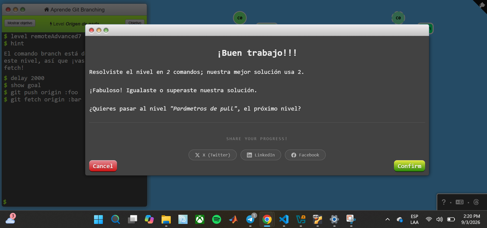

****Aprendizaje:****

Aprendí que Git permite utilizar un origen vacío en los comandos `git push` y `git fetch`. En `git push`, enviar "nada" hacia una rama remota provoca que dicha rama sea eliminada. En cambio, en `git fetch`, utilizar un origen vacío permite crear una nueva rama local en el destino especificado.

### R2.8 - Parámetros de `git pull`

****Objetivo:****

Aprender a utilizar los parámetros de `git pull` y comprender que este comando es un atajo para realizar un `git fetch` seguido de un `git merge`. También aprender a utilizar la sintaxis `<origen>:<destino>` para especificar dónde descargar los commits y posteriormente fusionarlos con la rama actual.

****Estado inicial:****

El repositorio contiene ramas locales y remotas que serán utilizadas para descargar commits y realizar las fusiones correspondientes. En este nivel se deben utilizar parámetros de origen y destino para alcanzar el estado objetivo.

| Paso | Comando                   | Efecto sobre el repositorio                                                                                                                              |
| ---: | ------------------------- | -------------------------------------------------------------------------------------------------------------------------------------------------------- |
|    1 | `git pull origin c3:foo`  | Descarga desde `origin` la referencia `c3` y la incorpora en una nueva rama local `foo`. Posteriormente, realiza un merge de `foo` sobre la rama actual. |
|    2 | `git pull origin c2:side` | Descarga desde `origin` la referencia `c2` y la incorpora en la rama local `side`. Posteriormente, realiza un merge de `side` sobre la rama actual.      |

****Estado final:****

Los commits especificados desde el repositorio remoto `origin` son descargados hacia las ramas locales `foo` y `side`, y posteriormente cada una de estas ramas se fusiona con la rama actual mediante el comportamiento combinado de `git fetch` y `git merge`.


****Aprendizaje:****

Aprendí que `git pull` es un atajo para ejecutar un `git fetch` seguido de un `git merge`. También aprendí que puede utilizar la sintaxis `<origen>:<destino>` para indicar específicamente de dónde descargar los commits y en qué rama local almacenarlos antes de realizar la fusión con la rama actual.

### Remote completo 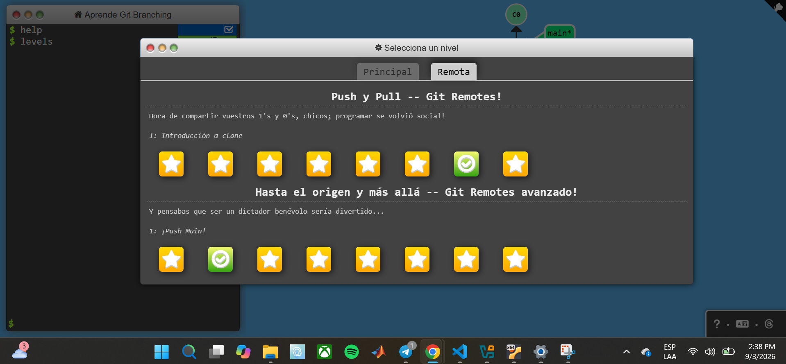

## Tabla resumen de niveles

| ID | Secuencia | Nivel | Estado |
|---|---|---|:---:|
| M1.1 | Introduction Sequence | Introduction to Git Commits | ✅ |
| M1.2 | Introduction Sequence | Branching in Git | ✅ |
| M1.3 | Introduction Sequence | Merging in Git | ✅ |
| M1.4 | Introduction Sequence | Rebase Introduction | ✅ |
| M2.1 | Ramping Up | Detach yo' HEAD | ✅ |
| M2.2 | Ramping Up | Relative Refs (`^`) | ✅ |
| M2.3 | Ramping Up | Relative Refs #2 (`~`) | ✅ |
| M2.4 | Ramping Up | Reversing Changes in Git | ✅ |
| M3.1 | Moving Work Around | Cherry-pick Intro | ✅ |
| M3.2 | Moving Work Around | Interactive Rebase Intro | ✅ |
| M4.1 | A Mixed Bag | Grabbing Just 1 Commit | ✅ |
| M4.2 | A Mixed Bag | Juggling Commits | ✅ |
| M4.3 | A Mixed Bag | Juggling Commits #2 | ✅ |
| M4.4 | A Mixed Bag | Git Tags | ✅ |
| M4.5 | A Mixed Bag | Git Describe | ✅ |
| M5.1 | Advanced Topics | Rebasing over 9000 times | ✅ |
| M5.2 | Advanced Topics | Multiple parents | ✅ |
| M5.3 | Advanced Topics | Branch Spaghetti | ✅ |
| R1.1 | Push & Pull - Git Remotes | Clone Intro | ✅ |
| R1.2 | Push & Pull - Git Remotes | Remote Branches | ✅ |
| R1.3 | Push & Pull - Git Remotes | Git Fetchin' | ✅ |
| R1.4 | Push & Pull - Git Remotes | Git Pullin' | ✅ |
| R1.5 | Push & Pull - Git Remotes | Faking Teamwork | ✅ |
| R1.6 | Push & Pull - Git Remotes | Git Pushin' | ✅ |
| R1.7 | Push & Pull - Git Remotes | Diverged History | ✅ |
| R1.8 | Push & Pull - Git Remotes | Locked Main | ✅ |
| R2.1 | To Origin And Beyond - Advanced Git Remotes | Push Main! | ✅ |
| R2.2 | To Origin And Beyond - Advanced Git Remotes | Merging with remotes | ✅ |
| R2.3 | To Origin And Beyond - Advanced Git Remotes | Remote Tracking | ✅ |
| R2.4 | To Origin And Beyond - Advanced Git Remotes | Git push arguments | ✅ |
| R2.5 | To Origin And Beyond - Advanced Git Remotes | Git push arguments - Expanded! | ✅ |
| R2.6 | To Origin And Beyond - Advanced Git Remotes | Fetch arguments | ✅ |
| R2.7 | To Origin And Beyond - Advanced Git Remotes | Source of nothing | ✅ |
| R2.8 | To Origin And Beyond - Advanced Git Remotes | Pull arguments | ✅ |

## Síntesis de los conceptos aprendidos

Durante el desarrollo de los niveles de Learn Git Branching se estudiaron diferentes operaciones de Git y su efecto sobre el historial de un repositorio. Uno de los conceptos fundamentales fue la utilización de **commits y ramas** para organizar el desarrollo de un proyecto. Los commits representan estados del proyecto, mientras que las ramas funcionan como referencias que permiten mantener diferentes líneas de desarrollo. También se comprendió el papel de `HEAD`, que indica la posición actual dentro del historial.

Uno de los principales conceptos estudiados fue la integración de ramas mediante `merge` y `rebase`. `merge` permite combinar diferentes líneas de desarrollo y puede generar un nuevo commit de fusión, conservando la estructura de ramificación del historial. `rebase`, en cambio, permite colocar una serie de commits sobre una nueva base, generando normalmente un historial más lineal. Esta diferencia permitió comprender que ambas operaciones pueden producir un resultado funcional similar, pero modifican la estructura del historial de manera diferente.

También se trabajó con **referencias relativas**, utilizando expresiones como `^` y `~` para desplazarse hacia commits anteriores. Estas referencias permiten localizar commits sin necesidad de conocer directamente sus identificadores. Además, se estudió el estado *detached HEAD*, en el cual `HEAD` apunta directamente a un commit en lugar de hacerlo mediante una rama.

Otro grupo importante de conceptos correspondió a la **reversión y reorganización de cambios**. Mediante `reset` y `revert` se observó que existen diferentes formas de deshacer modificaciones. `reset` permite mover una referencia hacia otro commit, mientras que `revert` genera un nuevo commit que invierte los cambios realizados previamente. También se estudiaron `cherry-pick`, para incorporar commits específicos, y los tags, utilizados para identificar puntos importantes del historial.

Los niveles de repositorios remotos permitieron comprender la interacción entre el repositorio local y un repositorio remoto. Se analizaron comandos como `fetch`, `pull`, `merge` y `push`, observando que cada uno cumple una función diferente en el intercambio e integración de cambios. También se estudiaron las ramas remotas y las referencias de seguimiento remoto, así como situaciones donde los historiales divergen o existen restricciones para realizar `push`.

Finalmente, los niveles avanzados permitieron comprender que Git ofrece un control bastante preciso sobre las referencias y el historial. Las operaciones de `push`, `fetch` y `pull` pueden recibir argumentos que permiten seleccionar específicamente el origen y destino de los cambios. En conjunto, los ejercicios permitieron relacionar cada comando con su efecto sobre el grafo de commits y comprender que Git no solamente almacena versiones, sino que administra referencias que permiten navegar, reorganizar, integrar y compartir el historial de un proyecto.

## Análisis obligatorio de Git

### 1. ¿Cuál es la diferencia entre `merge` y `rebase`? ¿Qué ocurre con el historial en cada caso?

`merge` y `rebase` permiten integrar los cambios de diferentes ramas, pero modifican el historial de manera diferente.

* **`git merge`** combina dos líneas de desarrollo y normalmente crea un nuevo *commit* de combinación (*merge commit*). De esta manera, se conserva el historial original de ambas ramas y se puede observar que existieron desarrollos paralelos.
* **`git rebase`** toma los *commits* de una rama y los vuelve a aplicar sobre otra base. Esto genera un historial más lineal, pero los *commits* reaplicados adquieren nuevos identificadores.

En los niveles resueltos, al utilizar `merge`, las ramas se unieron mediante un nuevo *commit*, conservando la estructura ramificada. En cambio, con `rebase`, los *commits* de una rama fueron colocados después de los *commits* de la nueva base, haciendo que el historial tuviera una apariencia lineal.

| `git merge`  | Conserva las ramas y puede crear un *merge commit*.                    |
| `git rebase` | Reescribe la secuencia de *commits* para producir un historial lineal. |

---

### 2. ¿Cuándo conviene utilizar `reset` y cuándo `revert`?

`reset` y `revert` permiten deshacer cambios, pero funcionan de maneras diferentes.

**`git reset`** mueve el puntero `HEAD` hacia otro *commit* y, dependiendo de la opción utilizada, también puede modificar el *staging area* y los archivos de trabajo. Es conveniente cuando se trabaja localmente y se desea eliminar o reorganizar *commits* que todavía no han sido compartidos.

Por ejemplo:

```bash
git reset HEAD~1
```

permite regresar un *commit* en el historial.

**`git revert`** no elimina el *commit* original, sino que crea un nuevo *commit* que invierte sus cambios. Por esta razón, es más apropiado cuando los cambios ya fueron compartidos con otros colaboradores.

Por lo tanto:

* `reset` → modifica o mueve el historial existente.
* `revert` → conserva el historial y agrega un nuevo *commit* que deshace los cambios.

---

### 3. ¿Qué significa tener `HEAD` separado o *detached*?

Normalmente, `HEAD` apunta a una rama y esa rama apunta al *commit* actual. Cuando se tiene un **`detached HEAD`**, `HEAD` apunta directamente a un *commit* en lugar de apuntar a una rama.

Por ejemplo:

```bash
git checkout C2
```

puede dejar al repositorio en un estado donde `HEAD` apunta directamente al *commit* `C2`.

Esto permite revisar o experimentar con el estado de un *commit* específico sin estar trabajando directamente sobre una rama.

Sin embargo, si se crean nuevos *commits* mientras `HEAD` está separado y posteriormente se cambia de rama, estos *commits* pueden quedar sin una referencia que los mantenga accesibles fácilmente.

---

### 4. ¿Qué diferencia existe entre una rama local, una rama remota y una rama de seguimiento remoto?

Una **rama local** es una rama que existe en el repositorio local y sobre la cual se puede trabajar directamente.

Por ejemplo:

```text
main
feature
```

Una **rama remota** hace referencia a una rama existente en un repositorio remoto.

Una **rama de seguimiento remoto** (*remote-tracking branch*) es una referencia local que Git mantiene para representar el estado conocido de una rama del repositorio remoto.

Por ejemplo:

```text
origin/main
```

representa el estado de `main` en el remoto `origin` que Git conoce localmente.

La diferencia principal es que:

* `main` → rama local sobre la que se trabaja.
* `origin/main` → referencia local al estado conocido de `main` en el repositorio remoto.
* El repositorio remoto → contiene realmente la rama publicada.

---

### 5. ¿Qué hacen individualmente `fetch`, `merge`, `pull` y `push`?

#### `git fetch`

Descarga información y nuevos *commits* desde el repositorio remoto, pero **no integra automáticamente esos cambios en la rama local**.

```bash
git fetch
```

Después de realizar un `fetch`, es posible revisar los cambios antes de decidir cómo integrarlos.

#### `git merge`

Integra los cambios de una rama dentro de otra.

```bash
git merge origin/main
```

Esto combina los cambios de `origin/main` con la rama local actual.

#### `git pull`

Realiza, de forma general, dos operaciones:

```text
fetch + merge
```

Es decir, descarga los cambios del repositorio remoto y posteriormente intenta integrarlos en la rama local.

#### `git push`

Envía los *commits* de una rama local hacia el repositorio remoto.

```bash
git push origin main
```

### 6. ¿Qué riesgos existen al reescribir un historial que ya fue compartido?

Reescribir un historial que ya fue compartido puede generar problemas para los demás colaboradores, debido a que los *commits* originales pueden desaparecer de la línea principal o ser reemplazados por otros con identificadores diferentes.

Esto puede ocurrir, por ejemplo, al utilizar `rebase` o `reset` sobre *commits* que ya fueron enviados al repositorio remoto.

Los principales riesgos son:

* Crear divergencias entre las copias locales de los colaboradores.
* Generar conflictos al intentar volver a subir los cambios.
* Hacer que los *commits* que otros colaboradores ya tenían dejen de coincidir con el historial remoto.
* Tener que utilizar un *force push*, lo que puede sobrescribir cambios existentes.

Por esta razón, `rebase` y `reset` deben utilizarse con cuidado sobre ramas cuyo historial ya fue compartido.

---

### 7. ¿Para qué resultan útiles `cherry-pick`, las referencias relativas y los tags?

#### `cherry-pick`

Permite tomar un *commit* específico y aplicarlo sobre la rama actual sin tener que incorporar toda la rama donde originalmente se creó.

Por ejemplo:

```bash
git cherry-pick C3
```

Esto resulta útil cuando solamente se necesita un cambio particular realizado en otra rama.

#### Referencias relativas

Permiten desplazarse desde una referencia conocida utilizando expresiones como:

```text
HEAD^
HEAD~3
```

Por ejemplo:

```bash
git checkout HEAD~2
```

permite referirse a un *commit* anterior sin tener que escribir directamente su identificador.

#### Tags

Los *tags* permiten asignar nombres descriptivos a determinados *commits*. Son especialmente útiles para identificar versiones importantes del proyecto.

Por ejemplo:

```bash
git tag v1.0
```

permite identificar un *commit* como la versión `v1.0`.

---

### 8. ¿Qué diferencias identificó entre el simulador y un repositorio Git real?

La principal diferencia es que **Learn Git Branching es una herramienta pedagógica diseñada para representar visualmente el funcionamiento de Git**, por lo que utiliza algunas convenciones y comandos propios del simulador.

Por ejemplo, los *commits* aparecen identificados mediante nombres sencillos como:

```text
C0
C1
C2
C3
```

Estos identificadores facilitan seguir visualmente el movimiento de las ramas y de `HEAD`. En un repositorio Git real, los *commits* se identifican mediante hashes, por ejemplo:

```text
a84f3c2...
```

Otra particularidad del simulador es la representación abreviada de las ramas remotas mediante:

```text
o/
```

Por ejemplo:

```text
o/main
```

representa de forma abreviada a:

```text
origin/main
```

Además, Learn Git Branching posee comandos creados específicamente para simular situaciones que ocurrirían en un entorno colaborativo. Un ejemplo es:

```bash
git fakeTeamwork
```

Este comando **no pertenece a Git real**. Es una herramienta propia del simulador que permite representar el trabajo realizado por otros colaboradores en un repositorio remoto.

Por lo tanto, aunque los conceptos fundamentales aprendidos en los niveles —como `merge`, `rebase`, `reset`, `revert`, `fetch`, `pull`, `push`, `HEAD` y las ramas— corresponden a Git real, la representación visual y algunos comandos utilizados son propios de **Learn Git Branching**.

En un repositorio real, en lugar de trabajar con identificadores pedagógicos como `C0`, `C1` y `C2`, se utilizan hashes de *commits*. Asimismo, las operaciones con repositorios remotos se realizan sobre servicios y repositorios reales, como GitHub o GitLab, mientras que comandos como `git fakeTeamwork` solamente existen para fines educativos dentro del simulador.
